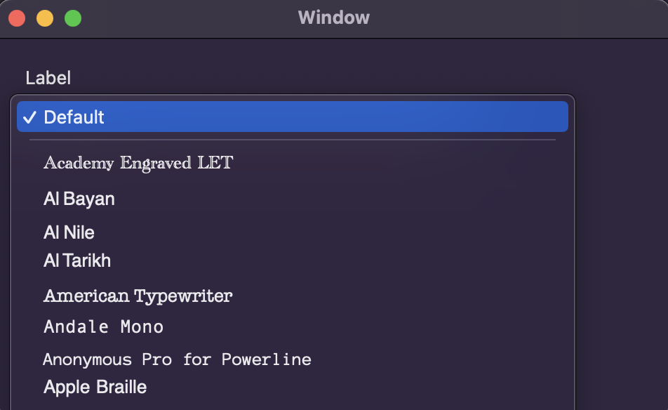

# FontPopUp

A very simple Font Picker for macOS

# Why use this?

I needed a simple way to allow users to pick a font in one of my apps, and found that the stock NSFontPicker can be a bit dense for the user to navigate, and the APIs aren't documented very well. If all you really need is a simple way to pick an installed font, this control should hopefully do the trick. 

---

# Instructions
- Add the FontPopUp package to your project through Swift Package Manager
- If you're using UIKit, use the `FontPopUpButton` class
- If you're using SwiftUI, use the `FontPicker` class

# Filtering the font list
- You can restrict the fonts that appear on the list using an `NSFontTraitMask`. 
	- If you're using UIKit, set the `fontTraitsFilter` property on `FontPopUpButton`
	- If you're using SwiftUI, set the `traitsFilter` argument when initalizing `FontPicker`
